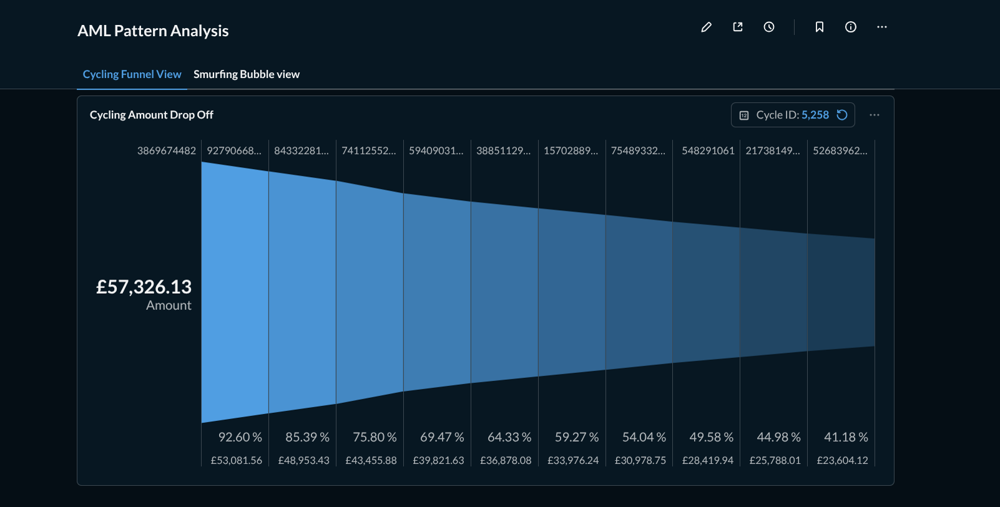
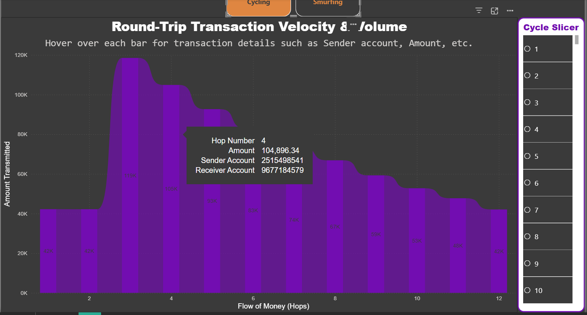
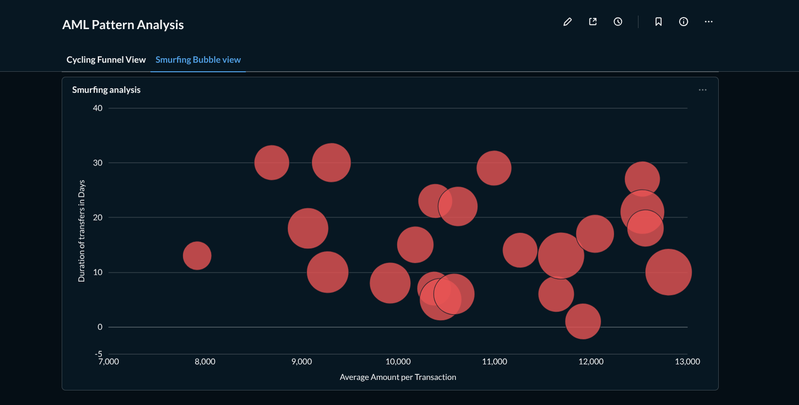
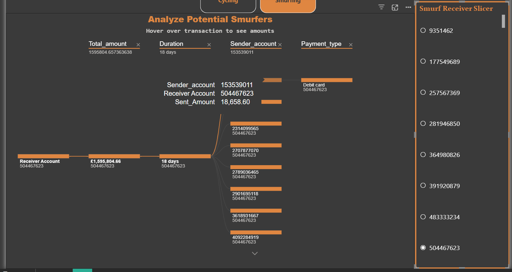

# AML Forensic Detection: Graph Based Typology Parsing
This project focuses on detecting sophisticated money laundering patterns like Cycling and Smurfing using graph traversal techniques on synthetic transaction data using Python, DuckDB, SQL, etc.

## Overview
Built a forensic engine to detect AML typologies (Cycling & Smurfing) in an 855k+ transaction dataset. Successfully reduced processing overhead by pivoting from PySpark to a custom DuckDB + DFS implementation, achieving rapid analytical inference on a single machine.

## Tech Stack and Evolution
* Database: DuckDB for high performance analytical queries on the SAML-D dataset in the CSV format.

* Engine: In-memory graph construction and a Depth First Search (DFS) algorithm for the 'Cycling' AML typology.

* Visualization: Power BI [Dashboard here](https://app.fabric.microsoft.com/view?r=eyJrIjoiNWJkMGRjMmMtNmRiMy00ZGZmLWJiNzktZDA3ZTg5YzQwMTM4IiwidCI6IjcxYjQwNGVhLTQ0Y2ItNDM1YS1hMTRkLWQzM2FhZTM3NmFkYyIsImMiOjl9&pageName=1e0175171e72c8ca18e9).

## Development Journey
Initially, I attempted to process this huge 9M+ rows dataset using PySpark. However, I found that the overhead of Spark’s distributed architecture was not the right tool for the specific recursive nature of "Cycle Detection" on this dataset. And, I was not prepared for how much memory Spark can consume locally 😅

I pivoted to a DuckDB + DFS approach. The script retrieves transactions into an in-memory graph and a DFS algorithm identifies paths that loop back to the originator. DuckDB allows me to maintain the speed of CSV data retrieval I loved from PySpark while allowing for much more detailed and flexible filters thanks to SQL.

Roadmap: To improve performance and handle deeper "hops" I am currently learning Neo4j to implement it in place of the DFS algorithm. This will replace the manual DFS with native graph query language (Cypher) for faster pattern matching.

Update: Neo4j was a bust since exploring hops basically slowly crushes it over time and none of the plugins seem to help - APOC, GDS, etc. I'm considering this a dead end for now. I went on to try KuzuDB, igraph, and rustworkx but nothing seems to be faster than the current implementation, so that's that.

The Smurfing analysis was unified within a DuckDB query highlighting the versatility and speed that DuckDB offers.

Forensic Visualizations
The dashboard consists of 2 distinct investigative views designed to switch between an analysis of Smurfing and Cycling typologies.

1. The Cycling Suite (Round Tripping)
Waterfall Cycle Chart: This visualizes the capital flow across intermediaries. It tracks how money is moved through multiple hops before returning to the source to obscure investigations regarding source of funds. Most of the cycles I detected were of length 4, which I believe in part is due to my strict 20% variation limit between the amount first sent and the final amount received. A higher tolerance may account for money lost in transaction fees, but I'm sticking to this strict filter for now.

Hover Detail Overlay: A dynamic tooltip view that reveals specific transaction details like Amounts, Senders, and Receivers when hovering over any bar in the waterfall.

2. The Smurfing Suite (Structuring)
Decomposition Tree: A root cause analysis tool that breaks down a "Final Receiver" account to reveal the dozens of small fragmented "Smurf" accounts feeding it via multiple payment methods in short durations. Click through values when you select a new receiver to see the total amount, duration, distinct senders, and payment methods used by senders.

Smurf Hover Analysis: An investigative overlay providing the specific amounts for each branch in the decomposition tree - per sender, per payment method, etc.

## Dataset Credits

This project utilizes the [SAML-D (Synthetic Anti-Money Laundering) dataset from Kaggle](https://www.kaggle.com/datasets/berkanoztas/synthetic-transaction-monitoring-dataset-aml/data).

Citation: B. Oztas, D. Cetinkaya, F. Adedoyin, M. Budka, H. Dogan and G. Aksu, "Enhancing Anti-Money Laundering: Development of a Synthetic Transaction Monitoring Dataset," 2023 IEEE International Conference on e-Business Engineering (ICEBE), Sydney, Australia, 2023, pp. 47-54, doi: 10.1109/ICEBE59045.2023.00028.

## How to use
1. Clone the repo
2. Python Script: Run the data_checker.py script (if you have enough memory, aka at least 16 GB on your compute, as this DFS requires an in-memory graph of a 9.5M rows dataset) to generate the processed CSVs (They are already pre-loaded, but you can see the script in action this way).
3. Power BI: Load the generated files into the .pbix file to refresh the Waterfall and Decomposition visuals (Refresh paths using the edit query method on each table for your local PC).
