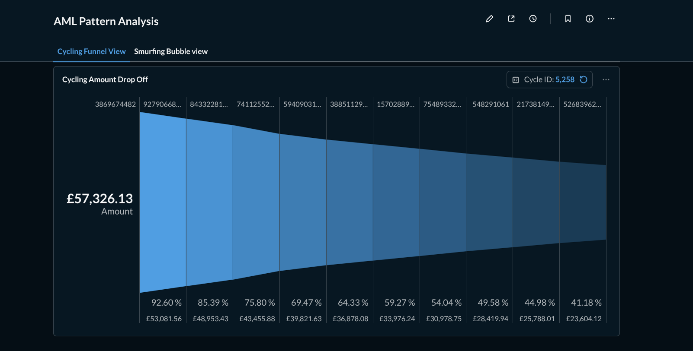
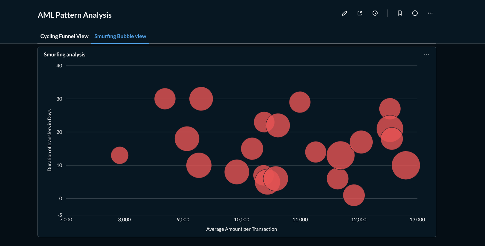

# AML Forensic Detection: Graph Based Typology Parsing
This project focuses on detecting sophisticated money laundering patterns like Cycling and Smurfing using graph traversal techniques on synthetic transaction data using Memgraph, Python, DuckDB, SQL, Metabase, etc.

## Overview
Built a forensic engine to detect AML typologies (Cycling & Smurfing) in a 9M+ transaction dataset. Successfully reduced processing overhead by pivoting from PySpark to a custom DuckDB + DFS implementation, achieving rapid analytical inference on a single machine. This was further improved upon by  switching to Memgraph, an in-memory graph database, bringing the cyxle detection time down to seconds from minutes.

## Tech Stack and Evolution
* Databases: DuckDB for high performance analytical queries on the SAML-D dataset in the CSV format, and Memgraph for complex pattern detection like Cycling.

* Visualization: Metabase

## Development Journey
Initially, I attempted to process this huge 9M+ rows dataset using PySpark. However, I found that the overhead of Spark’s distributed architecture was not the right tool for the specific recursive nature of Cycle Detection on this dataset. And, I was not prepared for how much memory Spark can consume locally 😅

I pivoted to a DuckDB + DFS approach. The script retrieves transactions into an in-memory graph structure and a DFS algorithm identifies paths that loop back to the originator. DuckDB allows me to maintain the speed of CSV data retrieval I loved from PySpark while allowing for much more detailed and flexible filters thanks to SQL.

To improve performance and handle deeper hops I am currently learning Neo4j to implement it in place of the DFS algorithm. This will replace the manual DFS with native graph query language (Cypher) for faster pattern matching.

Update: Neo4j was a bust since exploring hops basically slowly crushes it over time and none of the plugins seem to help - APOC, GDS, etc. I'm considering this a dead end for now. I went on to try KuzuDB, igraph, and rustworkx but nothing seems to be faster than the current implementation, so that's that.

I went on to improve my Cypher knowledge, certifying as a Neo4j certified technical professional (free t-shirt for being certified on the way!). This led to a better understanding of the importance of data modeling, prompting me to experiment with several data models I thought would fit my use case. I also discovered Quantified Path Patterns (QPP) that seemed great for upto 3 hops, but crushed later on.

This is when I discovered Memgraph, and my Cypher knowledge was instantly transferable, creating a zero-friction experimentation scenario. I was ecstatic to see a built-in `cycles.get` method that did the heavy lifting, and my improved data model by this point worked wonders alongside it. Memgraph detects cycles, which I then process for chronology checks, anchored to the start node and voila, I had my perfect optimized cycle detector!

The Smurfing analysis was unified within a DuckDB query highlighting the versatility and speed that DuckDB offers.

## Forensic Visualizations

The dashboard consists of 2 distinct investigative views designed to switch between an analysis of Smurfing and Cycling typologies.

### 1. The Cycling Suite (Round Tripping)

**Funnel Cycle Chart:** This visualizes the capital flow across intermediaries. It tracks how money is moved through multiple hops before returning to the source to obscure investigations regarding source of funds. Every intermediary takes a cut, and transaction fees must be eating into the transfer cycle as well, spanning a duration of 1-3 weeks usually.

Memgraph query execution and graph results visualization:

https://github.com/user-attachments/assets/ab8382aa-6566-43be-b557-098877682abe



### 2. The Smurfing Suite (Structuring)
Using DuckDB to identify Final Receiver accounts fed by dozens of fragmented "Smurf" accounts via multiple payment methods.

Scatter plot showing Duration vs Average amount per transaction for money mules:


### 3. Dashboard in Metabase containing both questions:

https://github.com/user-attachments/assets/90fe813c-edae-4237-9e36-2da064178e4b

## 🚀 How to Run
### 1. Prerequisites & Environment
* Memory: Minimum 16 GB RAM (required for the in-memory graph construction of 9.5M rows).
* Docker: Docker & Docker Compose installed.
* Python Setup: This project uses uv for package management.

**CRITICAL**: To avoid version headaches, ensure you have your own virtual environment (venv) active. Users must have their own compiled requirements.txt tailored to their specific system architecture/OS before attempting to run any Python logic. This is especially crucial given that I use Fedora, whose package versions may not match that of your OS.

### 2. Execution
#### Spin up the Memgraph and Metabase containers
`docker compose up -d`

Memgraph Labs (Visual query executors) is available at [http://localhost:3000](http://localhost:3000) and Metabase at [http://localhost:3001](http://localhost:3001) in a couple of minutes after this command is run.

Login to metabase using the following credentials to view the dashboard:

Email: `guest@gusto.com`

Password: `3tbuu8PMjMxO4Q`

#### Install dependencies using uv
```
uv pip compile requirements.in -o requirements.txt
uv pip install -r requirements.txt
```

#### Run the scanner to process data and load into the graph
`python data_pattern_scanner.py`

*Note*:I recommend commenting out the data loading queries in data_pattern_scanner.py as they seem to time out on lower memory systems. It is recommended to load the data in Memgraph labs.

### 3. Querying
The folder `/queries/cypher` contains the Cypher scripts needed to:
1. Create the index for accountID.
2. Load data from the /data directory.
3. Extract the cycles.

The `/queries/sql` subfolder contains the metabase questions that were used to build the visualizations.


## 📚 Dataset Credits
Utilizes the SAML-D (Synthetic Anti-Money Laundering) dataset.

Citation: B. Oztas et al., "Enhancing Anti-Money Laundering: Development of a Synthetic Transaction Monitoring Dataset," 2023 IEEE ICEBE.
