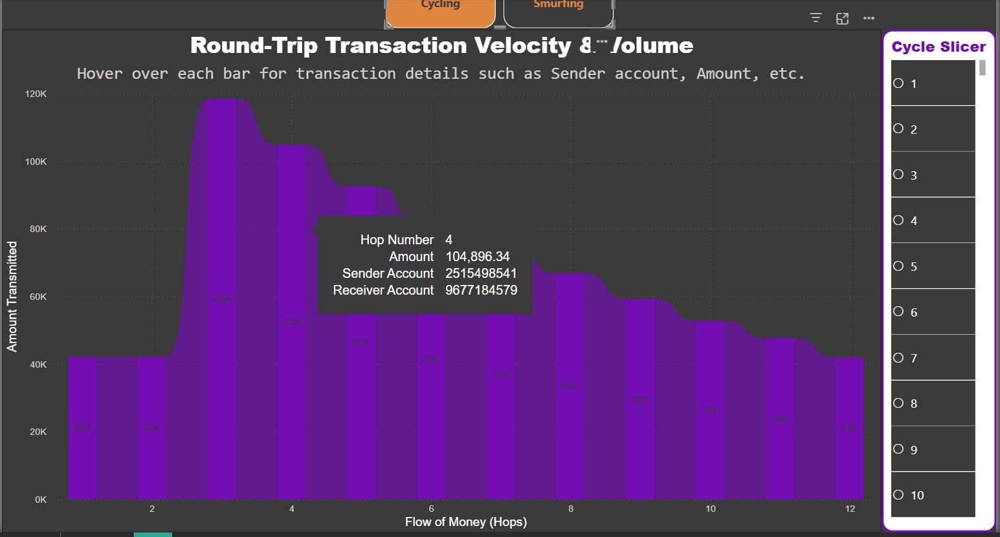
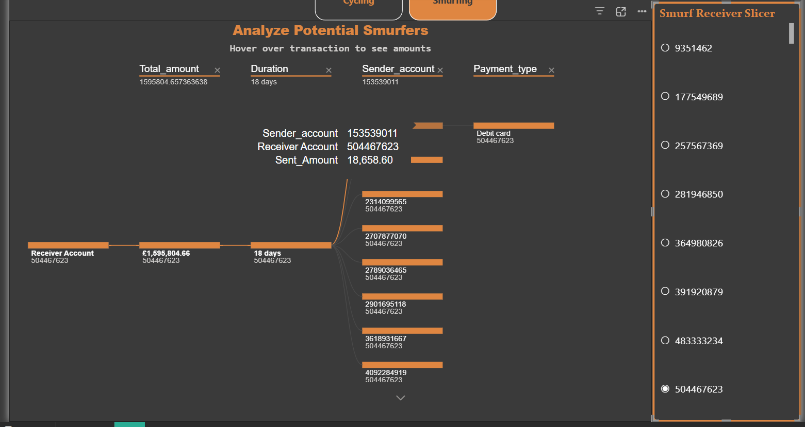

# AML Forensic Detection: Graph Based Typology Parsing
This project focuses on detecting sophisticated money laundering patterns like Cycling and Smurfing using graph traversal techniques on synthetic transaction data using Python, DuckDB, SQL, etc.

## Overview
Built a forensic engine to detect AML typologies (Cycling & Smurfing) in an 855k+ transaction dataset. Successfully reduced processing overhead by pivoting from PySpark to a custom DuckDB + DFS implementation, achieving rapid analytical inference on a single machine.

## Tech Stack and Evolution
* Database: DuckDB for high performance analytical queries on the SAML-D dataset in the CSV format.

* Engine: In-memory graph construction and a Depth First Search (DFS) algorithm for the 'Cycling' AML typology.

* Visualization: Power BI [Dashboard here](https://app.fabric.microsoft.com/view?r=eyJrIjoiNWJkMGRjMmMtNmRiMy00ZGZmLWJiNzktZDA3ZTg5YzQwMTM4IiwidCI6IjcxYjQwNGVhLTQ0Y2ItNDM1YS1hMTRkLWQzM2FhZTM3NmFkYyIsImMiOjl9&pageName=1e0175171e72c8ca18e9).

## Development Journey
Initially, I attempted to process this huge 9M+ rows dataset using PySpark. However, I found that the overhead of Spark’s distributed architecture was not the right tool for the specific recursive nature of "Cycle Detection" on this dataset. And, I was not prepared for how much memory Spark can consume locally 😅

I pivoted to a DuckDB + DFS approach. The script retrieves transactions into an in-memory graph and a DFS algorithm identifies paths that loop back to the originator. DuckDB allows me to maintain the speed of CSV data retrieval I loved from PySpark while allowing for much more detailed and flexible filters thanks to SQL.

Roadmap: To improve performance and handle deeper "hops" I am currently learning Neo4j to implement it in place of the DFS algorithm. This will replace the manual DFS with native graph query language (Cypher) for faster pattern matching.

Update: Neo4j was a bust since exploring hops basically slowly crushes it over time and none of the plugins seem to help - APOC, GDS, etc. I'm considering this a dead end for now. I went on to try KuzuDB, igraph, and rustworkx but nothing seems to be faster than the current implementation, so that's that.

The Smurfing analysis was unified within a DuckDB query highlighting the versatility and speed that DuckDB offers.

Forensic Visualizations
The dashboard consists of 2 distinct investigative views designed to switch between an analysis of Smurfing and Cycling typologies.

1. The Cycling Suite (Round Tripping)
Waterfall Cycle Chart: This visualizes the capital flow across intermediaries. It tracks how money is moved through multiple hops before returning to the source to obscure investigations regarding source of funds. Most of the cycles I detected were of length 4, which I believe in part is due to my strict 20% variation limit between the amount first sent and the final amount received. A higher tolerance may account for money lost in transaction fees, but I'm sticking to this strict filter for now.


Hover Detail Overlay:


### 2. The Smurfing Suite (Structuring)
Using DuckDB to identify Final Receiver accounts fed by dozens of fragmented "Smurf" accounts via multiple payment methods.

Analysis: Root cause decomposition showing payment method distribution and transaction frequency.
Decomposition Tree:


Smurf Hover Analysis:



## 🚀 How to Run
### 1. Prerequisites & Environment
* Memory: Minimum 16 GB RAM (required for the in-memory graph construction of 9.5M rows).
* Docker: Docker & Docker Compose installed.
* Python Setup: This project uses uv for package management.
CRITICAL: To avoid version headaches, ensure you have your own virtual environment (venv) active. Users must have their own compiled requirements.txt tailored to their specific system architecture/OS before attempting to run any Python logic. This is especially crucial given that I use Fedora, whose package versions may not match that of your OSs.

### 2. Execution
#### Spin up the Memgraph and Metabase containers
`docker-compose up -d`

#### Install dependencies using uv
```
uv pip compile requirements.in -o requirements.txt
uv pip install -r requirements.txt
```

#### Run the scanner to process data and load into the graph
`python data_pattern_scanner.py`

### 3. Querying
The folder /queries contains the Cypher scripts needed to:
1. Create indices for accountID.
2. Load data from the /data directory.
3. Execute get_cycles.cypher to extract the forensic loops.


## 🚧 Roadmap: 
### Visualization Update
Note: The current visualizations were built in Power BI (View Dashboard Here).To ensure a fully Linux-compatible, containerized experience, the visualization layer is currently being migrated to Metabase. This will allow the entire forensic suite to run on any environment via Docker without requiring a Windows-based Power BI gateway.

## 📚 Dataset Credits
Utilizes the SAML-D (Synthetic Anti-Money Laundering) dataset.Citation: B. Oztas et al., "Enhancing Anti-Money Laundering: Development of a Synthetic Transaction Monitoring Dataset," 2023 IEEE ICEBE.