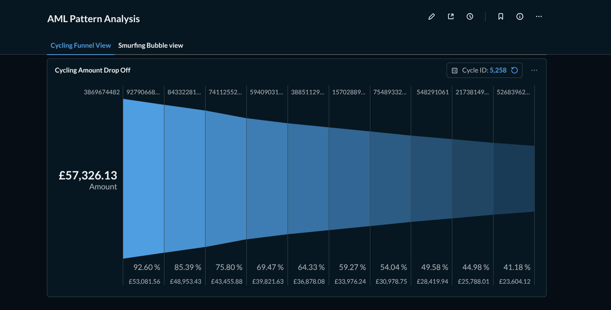
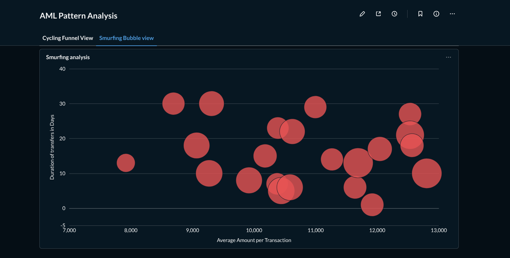

# AML Forensic Detection: Graph Based Typology Parsing

This project focuses on detecting sophisticated money laundering patterns like Cycling, Smurfing and Scatter-Gather using graph traversal techniques on synthetic transaction data using Memgraph, Python, DuckDB, SQL, Metabase, etc.

## Overview

Built a forensic engine to detect AML typologies (Cycling, Smurfing, Scatter-Gather & Deposit-Send) in a 9M+ transaction dataset. Successfully reduced processing overhead by pivoting from PySpark to a custom DuckDB + DFS implementation, achieving rapid analytical inference on a single machine. This was further improved upon by switching to Memgraph, an in-memory graph database, bringing the cycle detection time down to seconds from minutes.

**Live dashboard:** <https://anirudhbabu.github.io/AMLPatternDetection/>, a public, static copy of the Metabase dashboard (see Public Dashboard below).

Every detection can also be scored against SAML-D's ground-truth labels, so the project reports how well each detector works (precision, lift over the base rate, recall per laundering typology), not just how many patterns it found.

## Tech Stack and Evolution

- Databases: DuckDB for high performance analytical queries on the SAML-D dataset (via a typed Parquet copy of the CSV), and Memgraph for complex pattern detection like Cycling.

- Visualization: Metabase

- Engineering: uv for packaging, pytest, and GitHub Actions CI that also runs the Cypher against a live Memgraph + MAGE container.

## Development Journey

Initially, I attempted to process this huge 9M+ rows dataset using PySpark. However, I found that the overhead of Spark’s distributed architecture was not the right tool for the specific recursive nature of Cycle Detection on this dataset. And, I was not prepared for how much memory Spark can consume locally 😅

I pivoted to a DuckDB + DFS approach. The script retrieves transactions into an in-memory graph structure and a DFS algorithm identifies paths that loop back to the originator. DuckDB allows me to maintain the speed of CSV data retrieval I loved from PySpark while allowing for much more detailed and flexible filters thanks to SQL.

To improve performance and handle deeper hops, I then learned Neo4j to implement it in place of the DFS algorithm, replacing the manual DFS with a native graph query language (Cypher) for faster pattern matching.

Neo4j was a bust, since exploring hops basically slowly crushes it over time and none of the plugins seemed to help - APOC, GDS, etc. I went on to try KuzuDB, igraph, and rustworkx, but none of them was faster than the DuckDB + DFS implementation.

I went on to improve my Cypher knowledge, certifying as a Neo4j certified technical professional (free t-shirt for being certified on the way!). This led to a better understanding of the importance of data modeling, prompting me to experiment with several data models I thought would fit my use case. I also discovered Quantified Path Patterns (QPP) that seemed great for upto 3 hops, but crushed later on.

This is when I discovered Memgraph, and my Cypher knowledge was instantly transferable, creating a zero-friction experimentation scenario. I was ecstatic to see a built-in `cycles.get` method that did the heavy lifting, and my improved data model by this point worked wonders alongside it. Memgraph detects cycles, which I then process for chronology checks, anchored to the start node and voila, I had my perfect optimized cycle detector!

The Smurfing analysis was unified within a DuckDB query highlighting the versatility and speed that DuckDB offers.

## Forensic Visualizations

The "AML detectors" dashboard has six charts: one investigative view per detector (cycling, smurfing, scatter-gather and deposit-send), a scorecard of every detector's precision and lift, and recall per laundering typology. The [live dashboard](https://anirudhbabu.github.io/AMLPatternDetection/) is a static copy of it.

### 1. The Cycling Suite (Round Tripping)

**Funnel Cycle Chart:** This visualizes the capital flow across intermediaries. It tracks how money is moved through multiple hops before returning to the source to obscure investigations regarding source of funds. Every intermediary takes a cut, and transaction fees must be eating into the transfer cycle as well: across the 32 rings found in SAML-D, the average transfer shrinks from about 45,000 at the first hop to about 7,500 by the fifteenth. The rings pass through 5 to 15 accounts and take 9 to 21 days to come back around (about two weeks on average).

Memgraph query execution and graph results visualization:

https://github.com/user-attachments/assets/ab8382aa-6566-43be-b557-098877682abe



### 2. The Smurfing Suite (Structuring)

Using DuckDB to identify Final Receiver accounts fed by dozens of fragmented "Smurf" accounts via multiple payment methods.

Scatter plot showing Duration vs Average amount per transaction for money mules: 

### 3. Scatter-Gather and Deposit-Send

A table of scatter-gather episodes ranked by number of mules, and a histogram of how many hours cash sat in an account before it was sent on. Both detectors are described below.

### 4. Detector Scorecard and Recall by Typology

Precision and lift for every detector, and the share of each of SAML-D's suspicious typologies that each detector catches (see Evaluating the detectors below).

An earlier version of the dashboard in Metabase, with the cycling and smurfing questions:

https://github.com/user-attachments/assets/90fe813c-edae-4237-9e36-2da064178e4b

## 🕸️ Scatter-Gather (Layering Through Mules)

This detector looks for a source account that pays several intermediaries ("mules"), each of which passes most of the money on to the same destination soon after receiving it:

```
Source --> Mule 1 --> Destination
Source --> Mule 2 --> Destination
Source --> Mule 3 --> Destination
```

A leg counts when a mule passes on 50-105% of what it received within 7 days, and an episode needs at least 3 distinct mules inside a 30-day window. Each leg in `data/scatter_gather_suspects.csv` carries its hold time and forward ratio; each episode carries its mule count and gather ratio (money that reached the destination ÷ money scattered).

Unlike a cycle, this is a fixed two-hop shape, so it's a self-join rather than a graph traversal. DuckDB runs it, with the join cut into time buckets so busy accounts can't blow it up. `queries/cypher/show_scatter_gather.cypher` draws any episode in Memgraph Lab.

## 💵 Deposit-Send (Cash In, Sent Straight On)

One concrete rule: cash is deposited into an account, and within 72 hours the same account sends 80-105% of it to a different account by a non-cash payment. It's the moment cash enters the banking system and is moved on before it can be questioned.

```
cash deposit --> Account --> non-cash payment to another account (within 72 hours)
```

Each deposit is paired with the first qualifying payment after it. `data/deposit_send_suspects.csv` lists every pair with how long the money was held, the share sent on, where it went, and how many such pairs the account has in total. Unlike the other detectors this one is about payment *channels*. Which `Payment_type` values count as cash deposits and as cash is read from the data (types containing "cash" and "deposit", and types containing "cash"), or set with `--deposit-types` / `--cash-types`. `--cross-border-only` keeps only payments into a different bank location.

Only cash deposits are joined against later payments, using the same time-bucket trick as scatter-gather, so the join stays small even on the full dataset.

## 🚀 How to Run

### 1. Prerequisites

- Memory: 16 GB RAM recommended (Memgraph holds ~855K accounts and ~9.5M transfers in memory).
- Docker: Docker & Docker Compose installed.
- Nothing under `data/` is committed: SAML-D is downloaded, and the Parquet copy and every result are generated (see `.gitignore`).
- Python: [uv](https://docs.astral.sh/uv/). `uv sync` builds the environment from `pyproject.toml` and `uv.lock`, resolving the right packages for your OS.

### 2. Spin up the Memgraph and Metabase containers

```
docker compose up -d
```

Memgraph Lab (visual query executor) is available at <http://localhost:3000> and Metabase at <http://localhost:3001> a couple of minutes after this command is run.

The first time you open Metabase it shows its Welcome screen: create your own admin account there, or let `--create-admin` create it for you (see the Metabase Dashboard section below). Once the pipeline has run, `uv run aml metabase` builds the dashboards with that login.

### 3. Run the pipeline

```
uv sync
uv run aml run-all --with-metabase --admin-email you@example.com
```

`--with-metabase` asks for your Metabase admin password up front and checks it against Metabase before the pipeline starts, then builds the dashboard at the end. On a fresh Metabase, add `--create-admin` to create that admin account. Leave it off and run `uv run aml metabase --admin-email you@example.com` later if Metabase isn't up yet.

`python data_pattern_scanner.py` does the same thing. To run the steps one at a time:

| Command | What it does |
| --- | --- |
| `uv run aml fetch-data` | Puts SAML-D in `data/`, taking it from the first place that has it: `data/` itself, a file you name with `--from`, kagglehub's cache, then Kaggle |
| `uv run aml prepare` | One-time conversion to a typed Parquet file with a stable `tx_id` per transaction |
| `uv run aml load-graph` | Streams the Parquet into Memgraph over Bolt, so Memgraph never has to find a file. Skips if the graph is already loaded; `--reload` rebuilds it and `--workers 4` sends batches in parallel |
| `uv run aml cycles` | Cycling / round-tripping → `data/detected_cycles.csv` |
| `uv run aml smurfing` | Smurfing / fan-in bursts → `data/smurfing_suspects.csv` |
| `uv run aml scatter-gather` | Scatter-gather / layering through mules → `data/scatter_gather_suspects.csv` |
| `uv run aml deposit-send` | Cash deposits sent straight on → `data/deposit_send_suspects.csv` |
| `uv run aml evaluate` | Precision and recall against SAML-D's labels → `data/evaluation_*.csv` |
| `uv run aml export` | Copies every detector and evaluation result into `data/aml_results.sqlite`, which Metabase reads |
| `uv run aml metabase --admin-email you@example.com` | Logs in as your Metabase admin, connects that file and builds the dashboard; `--create-admin` sets up a fresh Metabase with that login, `--viewer-email` adds a view-only login |
| `uv run aml site --repo-url <repo URL>` | Renders the dashboard as one static page, `docs/index.html`, for GitHub Pages |
| `uv run aml verify-cycle 2521152088 718745407 8657935466 2361741456 2299468667` | Checks one cycle against the raw data in DuckDB, independently of Memgraph |

Every command takes `--help`. Without Memgraph running, `uv run aml run-all --skip-graph` does everything except the graph steps.

### 4. Tuning the detectors

| Option | Default | Meaning |
| --- | --- | --- |
| `cycles --max-window-days` | no limit | Longest a round trip may take, first hop to last |
| `cycles --min-len` / `--max-len` | 3 / 20 | Number of accounts in a cycle |
| `cycles --strict` | off | Each hop must happen strictly after the previous one |
| `cycles --all-instances` | off | Write every trip around a ring, not just the tightest one |
| `smurfing --window-days` | 30 | Rolling window per receiver |
| `smurfing --min-senders` | 10 | Distinct senders within a window (inclusive) |
| `smurfing --min-total` | 100000 | Amount received within a window (inclusive) |
| `smurfing --any-currency` | off | Drop the UK pounds → UK pounds filter |
| `scatter-gather --hop-days` | 7 | Longest a mule holds the money before passing it on |
| `scatter-gather --episode-days` | 30 | Window that must hold the whole episode |
| `scatter-gather --min-mules` | 3 | Distinct intermediaries (inclusive) |
| `scatter-gather --min-forward-ratio` / `--max-forward-ratio` | 0.5 / 1.05 | Share of the received amount a mule passes on |
| `deposit-send --max-hold-hours` | 72 | Longest the cash may sit before it is sent on |
| `deposit-send --min-send-ratio` / `--max-send-ratio` | 0.8 / 1.05 | Share of the deposit that must be sent on |
| `deposit-send --min-deposit` | 0 | Ignore smaller cash deposits |
| `deposit-send --cross-border-only` | off | Only payments into a different bank location |

`uv run aml evaluate` is the way to choose these: its cycle sweep shows precision and recall when cycles are capped at 1, 3, 7, 14 and 30 days, its scatter-gather sweep shows them as the minimum number of mules rises, and its deposit-send sweep shows them as the maximum holding time shrinks.

### 5. Querying in Memgraph Lab

The folder `/queries/cypher` contains the Cypher the pipeline runs, ready to paste into Lab:

1. `load_graph.cypher`: the statements `aml load-graph` streams, for reference.
2. `cycle_candidates.cypher`: the loop search behind `aml cycles`.
3. `show_cycle.cypher`: visualize one detected ring from its account ids.
4. `show_scatter_gather.cypher`: visualize one scatter-gather episode.

The `/queries/sql` subfolder contains the metabase questions that were used to build the visualizations.

### 6. Troubleshooting

**Metabase shows its "Welcome" setup screen**: it's a fresh Metabase. Create your admin account there, then run `uv run aml export` and `uv run aml metabase --admin-email you@example.com`. Or skip the screen: `uv run aml metabase --admin-email you@example.com --create-admin` creates that admin account for you.

**`Permission denied: 'data/SAML-D.csv'`** (or any other file under `data/`) means your user can't write to `data/`; check with `ls -ld data`, and take the folder back with `sudo chown -R $(id -u):$(id -g) data`. Every command checks `data/` before starting work and prints this fix, and `fetch-data` reuses a dataset already in kagglehub's cache instead of downloading it again.

## 📊 Metabase Dashboard

The dashboard is built from code, so every checkout gets the same one, and no credentials are stored in the repository.

1. **Create your admin account.** The first time you open <http://localhost:3001>, Metabase shows its Welcome screen. The account you create there is the admin. Keep it to yourself. To skip the Welcome screen, add `--create-admin` to the `metabase` command in step 2: on a Metabase nobody has set up yet, it creates the admin from `--admin-email` and the password you give it (asked for twice), through Metabase's setup API. Once Metabase is set up, the flag does nothing.
2. **Build the dashboard.** After the pipeline has run:

   ```
   uv run aml export
   uv run aml metabase --admin-email you@example.com
   ```

   `export` writes every result into `data/aml_results.sqlite`, which Metabase reads natively (`data/` is mounted into its container as `/data`). `metabase` asks for your admin password (or reads `MB_ADMIN_PASSWORD`). It connects that file as the "AML results" database and builds the "AML detectors" dashboard and its questions inside an "AML Forensics" collection.
3. **Share it view-only.** Add `--viewer-email guest@example.com` to create a login that can view the "AML Forensics" collection and nothing else, and can't write queries of its own. It asks for that login's password (or reads `MB_VIEWER_PASSWORD`); running it again resets the password.

Passwords are never taken as command-line flags, since those end up in your shell history. For automation, set `MB_ADMIN_EMAIL` and `MB_ADMIN_PASSWORD` (and the `MB_VIEWER_*` pair) in your environment, or in a `.env` file loaded with `uv run --env-file .env ...`. `.env` is gitignored.

The charts are the cycling funnel (average amount at each hop), smurfing duration vs average payment, scatter-gather episodes by number of mules, deposit-send hours held, the detector scorecard and recall by typology. Charts only appear for results that exist, and re-running both commands after the pipeline updates everything in place. Restricting non-admins needs Metabase 0.50 or newer; older versions print a note to set it in Admin > Permissions instead.

## 🌐 Public Dashboard

The [live dashboard](https://anirudhbabu.github.io/AMLPatternDetection/) is a static copy of the Metabase dashboard, so the results can be explored without running anything. It's a single page, `docs/index.html`, served by GitHub Pages: there's no server, login or database behind it, and it holds only aggregated results from SAML-D, a public synthetic dataset. Charts are interactive (Plotly, loaded from its CDN at a pinned version); tables show at most 100 rows and charts at most 5,000 points.

The page is generated, not hand-made: `uv run aml site` runs the dashboard's own questions (the same SQL) against the results that `uv run aml export` writes, so after running the pipeline the page can be rebuilt from those results.

## 📏 Evaluating the detectors

SAML-D labels every transaction (`Is_laundering`, plus one of 28 typologies in `Laundering_type`: 11 normal, 17 suspicious), and only about 0.1% of transactions are suspicious. `uv run aml evaluate` joins each flagged transaction back to its label through the `tx_id` assigned by `prepare`, and reports:

- **Precision and lift** for each detector, both per transaction and per account (the accounts an analyst would open a case on). Lift is precision divided by the base rate.
- **Recall for every suspicious typology**, which shows what each detector actually catches, including the typologies it picks up by accident.
- **A cycle-duration sweep**: precision and recall as cycles are capped at shorter and shorter durations.
- **A mule-count sweep** for scatter-gather: precision and recall as the minimum number of distinct mules rises.
- **A holding-time sweep** for deposit-send: precision and recall as the maximum hours between deposit and payment shrinks.

Results are printed and saved to `data/evaluation_summary.csv`, `data/evaluation_by_typology.csv` and one CSV per sweep (`data/evaluation_*_sweep.csv`). The sweeps score recall against specific typologies: `--cycle-label` (default `Cycle`), `--scatter-gather-label` (default `Scatter-Gather`) and `--deposit-send-label` (default `Deposit-Send`). If a label isn't in the data, the report lists the labels that are.

Results of `uv run aml run-all` with the default settings, on the full dataset (~9.5M transactions):

| Detector | Flagged transactions | Precision (transactions) | Lift | Flagged accounts | Precision (accounts) | Recall of its own typology (transactions) |
| --- | ---: | ---: | ---: | ---: | ---: | ---: |
| Cycling | 314 | 100% | 963× | 314 | 100% | 82.2% (`Cycle`) |
| Scatter-gather | 20 | 100% | 963× | 16 | 100% | 5.9% (`Scatter-Gather`) |
| Deposit-send | 45,703 | 1.83% | 17.6× | 42,944 | 3.94% | 82.2% (`Deposit-Send`) |
| Smurfing | 1,915,417 | 0.02% | 0.18× | 180,540 | 0.96% | 5.3% (`Smurfing`) |

Cycling and scatter-gather flag almost nothing that isn't laundering. Deposit-send catches most of its typology at many times the base rate. The smurfing rule, as configured, flags a fifth of all transactions at below the base rate, so it needs tighter thresholds before it's useful on its own.

## 🧪 Tests and CI

```
uv run pytest
```

The cycle logic is checked against a brute-force search over hundreds of random graphs, and the SQL runs on small hand-built datasets where the right answer is known. The integration test runs the real Cypher on a live Memgraph + MAGE; point it at a scratch instance (it refuses to touch a graph that already holds data):

```
MEMGRAPH_URI=bolt://localhost:7687 uv run pytest -m memgraph
```

GitHub Actions (`.github/workflows/ci.yml`) runs ruff and the unit tests on every push, and the integration test against a `memgraph/memgraph-mage` service container.

## 🗂️ Project Layout

```
aml/
  cli.py        the `aml` command
  dataset.py    SAML-D sources, Parquet preparation, batch readers
  graph.py      streaming Memgraph loader and cycle candidates
  outputs.py    every result file, and the one loader that reads them
  temporal.py   direction and chronology checks for cycles (pure Python)
  cycles.py     cycling detector
  smurfing.py   smurfing detector (DuckDB)
  scatter_gather.py
                scatter-gather detector (DuckDB)
  deposit_send.py
                deposit-send detector (DuckDB)
  evaluate.py   scoring against SAML-D's labels
  verify.py     independent cycle check in DuckDB
  dashboard.py  SQLite export and Metabase setup
  site.py       static copy of the dashboard for GitHub Pages
queries/        Cypher for Memgraph Lab, SQL behind the Metabase questions
tests/          pytest suite
```

## 📚 Dataset Credits

Utilizes the SAML-D (Synthetic Anti-Money Laundering) dataset.

Citation: B. Oztas et al., "Enhancing Anti-Money Laundering: Development of a Synthetic Transaction Monitoring Dataset," 2023 IEEE ICEBE.
